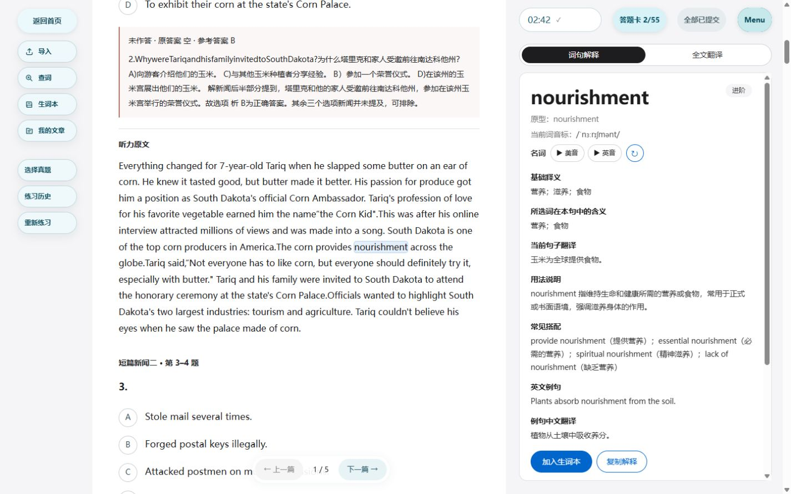

# CET 听力生产交付（2026-10-02）

已部署：https://context-reader.com/。公网和服务器接受状态一致：

| 字段 | 实际值 |
|---|---|
| releaseId | `20261002T152318` |
| parentReleaseId | `20261002T145029` |
| sourceRevision | `1667d2f8df69a8cdd7b8b2684432e5701d28ace6` |
| acceptedAt | `2026-10-02T07:27:35.077172+00:00` |
| backendMode | `mainland_internal` |

第一批听力于 `20261002T145029` 接受（父 `20261001T202200`，源 `b2abcc26d26fbf416984845959160d0d4d589fcb`，70 文件累计差异）。真实公网检查发现一处答案提取与原解析矛盾，以及提交后听力导航错误；原PDF核验后，以上最终版本以9文件精确差异修正。两次均通过稳定 `/opt/context-reader/bin/deploy-release`，保留锁、父版本复核、文件清单及九项保护契约，只重建 app/caddy。原音频单独核验安装，不进入源代码包。正常推送 main；本文及证据提交是后续文档更新，不改变部署的 sourceRevision。

## 已实现

- 在149套现有阅读中接入19套听力、475题、143组原文，18份去重原始录音。其余127套在该仓库无对应音频，3套音频存在但缺可靠原文，不加入听力题。[完整清单](cet-listening-source-report.md)。
- 播放器位于题组顶部，点击才请求音频。练习与提交后可暂停、拖动和重听；自测连续播放，不提供暂停、进度拖动或倍速。播放中暂停计时/换题被阻止；保存并离开允许，并标明中断。
- 听力为独立题型，不显示右侧题目窗。复用原答案草稿、题卡、提交全部和不可变结果；每组材料在提交后出现一份原文。练习可查选项，提交后原文和选项可查词；自测选项可加四色划记。
- 播放位置纳入原protocol-2同步；重开保留暂停位置，不自动播放。提前提交标明未听完；中断记录不当作完整可比较自测。旧30题阅读活动不被新增听力扩张，旧提交题目/原文/划记不被新题库覆盖。
- 原149份阅读JSON保留；保守审计596组，原Word唯一完整文本匹配后调整55处分段，原PDF底部坐标确认后移除5处页码。开发者排版覆盖优先，无法证明的段落保持原样。
- 2025年6月四级第1套第23题按原PDF第9页改为C；按原PDF第2/9页定点修正五处姓名、数字、空格识别。题库/目录身份同时更新；475题明确答案表述一致性审计无冲突。[依据](evidence/cet-listening-20261002/source-correction-proof.json)。

## 实际验证

| 验收 | 结果与证据 |
|---|---|
| 自动回归 | 85 CET、89核心、8提供商/一次计费、6媒体、7加载、9保护契约通过；本机和服务器正式构建通过，lint零错误，44警告。 |
| 公网数据 | 登录149套无重复，其中19套听力、475题、143组原文；两级游客各12套。目录不携带原文/录音/完整选项。[API证据](evidence/cet-listening-20261002/public-listening-smoke.json)。 |
| 原始音频 | 所有18份公网Range返回206、1024字节、正确MIME/总大小和immutable缓存。实际MP3原生解码readyState4；M4A原生解码无错误，实际播放至14.37秒。没有转码降质。 |
| 真实Reader | 练习播放/暂停；选择1A和23C，再真实“提交全部”，得到2/55、5/5组，听力显示8组原文，23C正确；提交停止播放，导航1/5→2/5→1/5，第一组上一篇禁用。 |
| 自测与划记 | 真实单篇25题自测，连续播放无滑块/暂停按钮；绿色选项划记保存；离开后重新打开显示03:11暂停，从191.37秒继续；提前提交停止音频，记录中断/未听完并固定划记。 |
| 原文与选项查词 | 真实slapping选项和nourishment原文查词返回中文解释/当前句译；最终原文查词截图见下方。 |
| 真实生产同步 | 两个独立IndexedDB客户端经公网protocol-2往返：42.5秒中断位置、8组原文提交快照、旧30题活动、普通文章保持，旧v2客户端往返无丢失、无删除事件。[证据](evidence/cet-listening-20261002/production-listening-client-sync.json)。 |
| AI与权限 | 最终版本签入新语境解释/句译、独立词典、两段全文翻译成功；各一次deepseek-flash执行/计费。匿名sync/models为401，开发者题库编辑403；恢复Admin读通过。[核心](evidence/cet-listening-20261002/live-core-postflight-final.json)、[台账](evidence/cet-listening-20261002/core-ledger-final.json)。 |
| 视觉 | 真正生产页面1440×900、390×844日夜截图；窄屏可用宽度375px/scrollWidth375，无横溢。播放器本机对比度日间11.75/16.83，夜间10.37/11.66；公网夜间未选字母rgb(220,235,237)。最终版本检查时无新增console error。 |
| 运维 | 公网/current/state身份精确一致，七服务健康；发布前SHA校验备份独立恢复17表通过；最终当前和直接父版本镜像存在，未实际回滚。[运维证据](evidence/cet-listening-20261002/operations-final.json)。 |

[桌面日间](evidence/cet-listening-20261002/public-desktop-day-final.jpg) / [桌面夜间](evidence/cet-listening-20261002/public-desktop-night-final.jpg) / [手机日间](evidence/cet-listening-20261002/public-mobile-day-final.jpg) / [手机夜间](evidence/cet-listening-20261002/public-mobile-night-final.jpg)。

## 尚未验证或本轮不实现

没有可靠时间边界，本轮不提供逐材料音频切片；提交后可重听整套录音。18份音频已全文件本地解码/转写，143组相似度88.7–100%用于排除错配，不能据此宣称逐字零OCR误差。尚未逐字人工校订全部原文/解析、完整人工听完所有音频；物理手机声音/触屏、Safari/Edge、弱网/后台设备中断全部组合和用户最终视觉接受仍开放。未证实的阅读分段不修改。合成验收账号单独保留，凭据未进入仓库。
