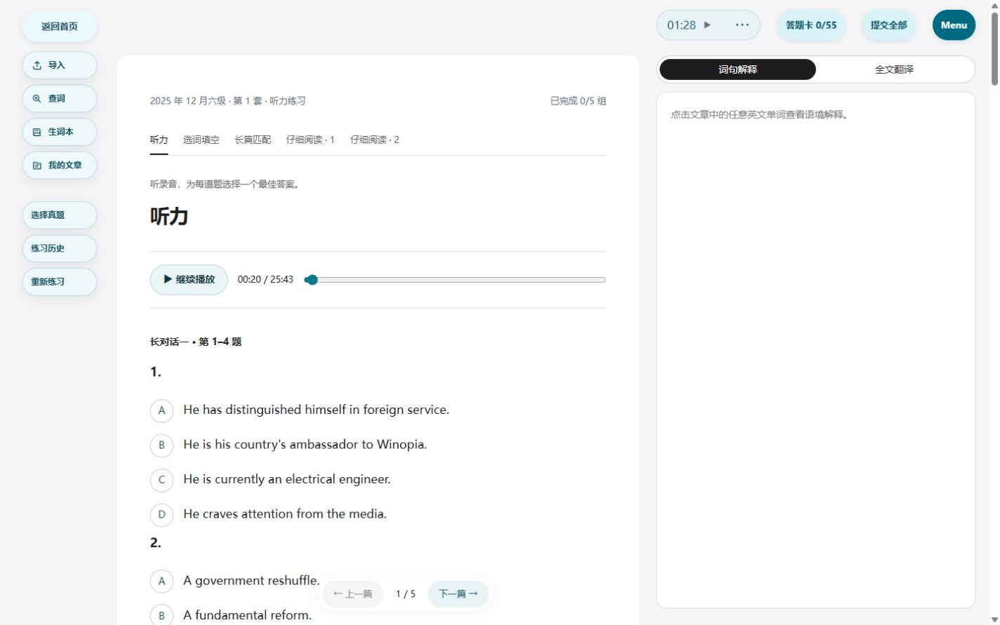

# CET GitHub听力增补发布证据

本轮新增43套，累计62套（四级31/六级31），1550题、465组原文、61份去重原始录音。原19套JSON逐字节保留，149套阅读基础数据不改。[来源与剩余87套清单](cet-listening-supplement-report.md)。

## 实际发布身份

| 发布 | releaseId | parentReleaseId | sourceRevision |
| --- | --- | --- | --- |
| 增补43套及资料入口 | 20261002T183827 | 20261002T154123 | 6823891a849ff3378932d9b25b6579834b90af5d |
| 原卷排版修正，当前生产 | 20261002T190651 | 20261002T183827 | 2958b1ccce2ee6b563afb21137eaa593b81617c0 |

当前版本于2026-10-02 11:10:50 UTC接受。公网connectivity精确返回releaseId、parentReleaseId和mainland_internal；sourceRevision由接受状态/清洁源码清单确认，current链接一致。增补84文件、修正19文件，均使用稳定deploy-release、全局锁、父版本重查及保护契约，只重建app/caddy。新增43份原始录音861279643字节，经SHA256校验独立安装到只读静态挂载；源码包没有音频。后续仅证据文档的main提交不改变生产sourceRevision。

## 验收

- 最终88 CET通过；本轮89核心、6媒体、7加载、8主备/单次计费、9保护契约通过。lint 0错误/44既有警告，本机及服务器正式构建和egress通过。
- [公网目录/录音](evidence/cet-listening-supplement/public-listening-smoke.json)：149套无重复，62套听力/1550题/465组；游客两级各12条轻量元数据；61份MP3/M4A全部206/1024字节Range、正确MIME/大小/immutable缓存；匿名sync/Admin权限保留。
- [登录核心](evidence/cet-listening-supplement/live-core.json)、[服务器账本](evidence/cet-listening-supplement/core-ledger.json)：新版本上线后解释/句译、词典、两段全文翻译完整，分别一个成功deepseek-flash执行/一次用量；恢复Admin会话和读取通过。
- [真实protocol-2双客户端](evidence/cet-listening-supplement/client-sync.json)：两个独立IndexedDB环境往返保留42.5秒位置、7组冻结原文与来源、旧30题范围、v3正计时40000ms、旧完整v2客户端及普通文章，没有删除墓碑。此为数据验收，不代替视觉验收。
- [真实公网Reader](evidence/cet-listening-supplement/public-final-reader-evidence.json)：新练习播放20.815秒可暂停，旧55题提交保留快照并提示版本不同，新题目采用修正文本。首版实际自测67.621秒后中断，提交如实标记未播完/曾中断，显示7组原文，选项distinguished查词/句译完成；没有宣称全程听完。[首版记录](evidence/cet-listening-supplement/public-initial-reader-evidence.json)。
- 桌面和390×844窄屏日夜截图见下方。无横向溢出，来源链接44px命中、日夜对比均高于4.5:1；键盘可达见[本机真实页面](evidence/cet-listening-supplement/browser-local-results.json)。公网无新增console error，仅既有Rapier弃用warning。最终主题/视口复原、计时/录音暂停。
- [运行证据](evidence/cet-listening-supplement/production-operations.json)：七服务健康，当前镜像b1190bb4263f、父镜像b75dd7a10c72保留。本轮SHA校验20261001T192539Z备份并隔离恢复17表通过，修正版再次核验相同备份SHA/健康；无schema变动，不重复无必要的全量恢复。
- [497处格式证据](evidence/cet-listening-supplement/final-option-formatting-proof.json)保持所有字母/数字及顺序；[13处原卷OCR纠正和百分比格式](evidence/cet-listening-supplement/targeted-original-corrections.json)独立记录。不同来源的选项顺序与干扰项版本不互相覆盖，题目/答案保留成对依据；原19套指纹继续通过。

[窄屏日间](evidence/cet-listening-supplement/public-final-mobile-day.jpg) · [窄屏夜间](evidence/cet-listening-supplement/public-final-mobile-night.jpg) · [日间来源](evidence/cet-listening-supplement/public-final-source-day.jpg) · [夜间来源](evidence/cet-listening-supplement/public-final-source-night.jpg) · [旧历史](evidence/cet-listening-supplement/public-frozen-history.jpg) · [提交查词](evidence/cet-listening-supplement/public-submitted-word-lookup.jpg)

## 尚未完成的验收与接入

87套未接入：30套本轮来源未定位到录音、8套候选错标、19套共用录音题序待核、12套材料待核、18套旧题型待接入；后四类不等于没有音频。新增43套提供真实参考答案及原文，未统一整理详细逐题解析，原19套解析不变。没有可靠材料时间边界，未做音频切片。完整人工听完、全体OCR逐字校订、物理手机/Safari/Edge、弱网中断组合及用户视觉确认未完成；来源对齐分数不等于准确率。
