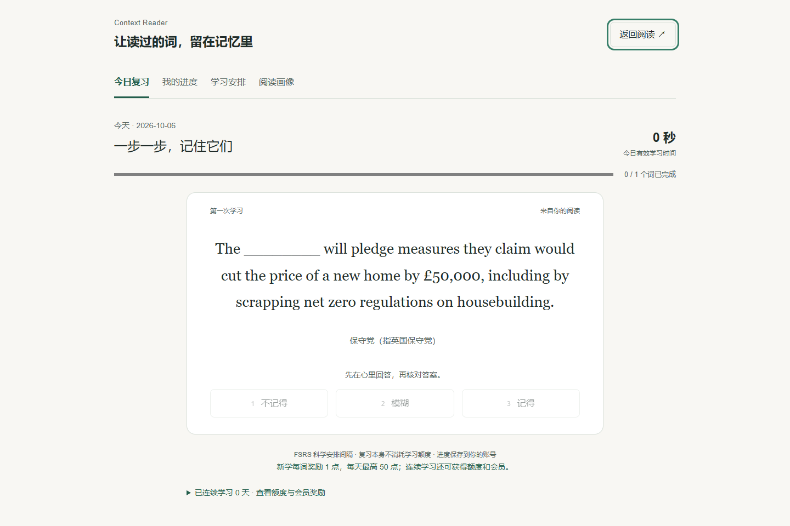
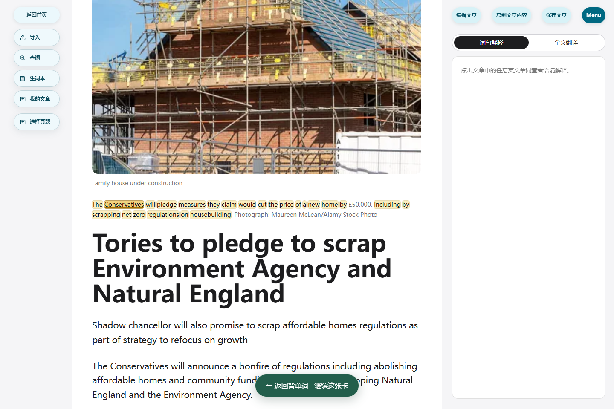
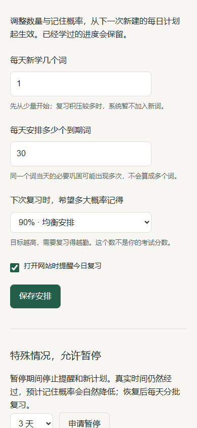

# 站内背单词发布验收

2026-10-06 正式站已接受 `20261006T000033`，父版 `20261005T131000`，生产源码 `704a0b776d218fe397e8501e986db928419cd0cd`。公网 `/api/connectivity` 返回相同版本和 `mainland_internal`；稳定入口 `/opt/context-reader/bin/deploy-release` 校验了干净源码、父版、精确 62 文件累积差异及保护契约。仅 app/caddy 重建，PostgreSQL/Auth/REST/Storage/内部网关启动时间未变。后续文档提交不改变这个生产源码身份。

## 已交付

- 实际 `ts-fsrs@5.4.2` FSRS-6 服务端排程；默认参数和短期学习步骤，完整保存作答与参数。没有个人权重训练，也没有复制任意现有 Anki 账户的历史排期。
- 不记得/模糊但错映射 Again，模糊但对为 Hard，记得且对为 Good；看原文后本次按辅助回忆处理。固定先完成计划中的旧词及其短期巩固，再学新词。
- 工作台、Menu、生词本及 `/study` 入口；今日提醒、有效计时、进度/设置、暂停、实际 Reader 定位及同一卡片返回。Anki 功能、模板和已有记录未删除，已导入的词默认等待迁移。
- 一新词一点、每天最多 50；全部计划完成且至少 5 新词才计连续，八档点数/会员奖励每账号一次。暂停断连续、已得奖励保留；后台可改门槛及奖励。会员权益待启用，不覆盖不同档现有会员；同档续期保留月度额度起点。
- 60 分钟有效阅读及 50 不同查词门槛，用户主动生成画像 5 点；重看/幂等重试免费，失败退款。建议基于观察证据，不声称精确词汇量。

详细产品规则见 [vocabulary-study.md](vocabulary-study.md)。

## 验证

| 层次 | 结果与边界 |
| --- | --- |
| 算法 | 9 项测试通过，包含 240 次连续评分对照实际上游库、四种答案映射、跨日/迟复习/暂停、计划完成、先复习和 Anki 排除。 |
| 原有核心 | 90 项 critical 通过；模型回退、账本和规则测试通过，独立智谱备用仍只收一次用户额度；九项发布契约与本地/服务器生产构建通过。 |
| 数据库 | 从真实备份恢复独立库后执行新增迁移，学习账本/奖励/原账本/所有已配置额度指标通过；8 个同时结算请求只增加一次 55 点、一次里程碑与连续天数。全部八档奖励、会员启用/同档延期/不同档保护在隔离 SQL 中覆盖。 |
| 学习公网 API | 真实登录和协议 2 生词保存；服务器评分、同请求幂等、旧版本 409、未结算撤销恢复、暂停后禁止开学及恢复通过；学习本身零扣点；错账号 409、跨域写 403、匿名 401；账号导出含完整学习历史。 |
| 奖励公网 API | 仅测试账号的一张卡预置为到期的最后学习步骤，真实 API 执行 FSRS 评分、完成计划、发放 1 点。重复评分和结算不重复入账，已结算撤销 409；只学一词不计连续日。 |
| 画像公网 API | 仅测试账号注入 3,600 秒和 70 个不同查词作为门槛夹具；真实模型生成一次扣 5 点，同操作重放免费。不是人工连续阅读一小时的验证。阈值不足、费用确认、并发锁和失败退款另由自动测试覆盖。 |
| 阅读核心公网 | 真正调用语境查词含句译、独立词典和两段全文翻译，实际账本均为 deepseek-flash；分别 1/5/10 点且没有悬挂预留。另一次语境查询用于构造来源卡片，画像另 5 点；7 条实际模型执行均成功。 |
| Admin | 普通账号拒绝；临时精确授予测试账号 Admin 后读取并原样保存政策成功，跨域写入 403。测试后立即恢复 Free，未改变线上奖励内容。 |
| 浏览器 | 本地真实组件+模拟 HTTP 与公网真实 API 分别检查。公网 Chrome 桌面 1440px/手机宽度 390px、核对答案、模糊分支、原文定位/同卡返回、90% 设置、暂停确认、关闭点击区、溢出、Escape/减少动态通过，未见页面错误。 |
| 运维 | 七服务运行健康；11 张新表均启用 RLS，普通角色不能写入。当前与父版镜像保留；只验证回退条件，没有对已接受生产实施回滚。 |

迁移前备份 `context-reader-20261005T160044Z.dump` 完成 SHA 校验和 23 表恢复。迁移后、测试账号清理后备份 `context-reader-20261005T162102Z.dump` 再次 SHA 校验成功，独立恢复 34 张 public 表。测试账号、学习数据、会话和奖励账单按精确 UUID+昵称条件清理；7 条供应商执行成本审计保留，所属账号置空并标记为测试。

验证期间两个环境事件单独记录：首轮 Python 核心测试在全文翻译请求连接前遇到本地代理假 IP 连接超时，随后将该脚本域名解析固定到已核对的生产 IP，保留域名和 TLS 证书验证后整轮通过；多轮测试反复登录触发登录 429，改用已有有效会话完成 Admin 测试，没有关闭或放宽限流。隔离恢复使用 `--no-privileges`，原账本 ACL 测试首次失败；生产权限核验正常，在独立库恢复原有权限后契约全部通过。

## 证据与未完成的验收

[运行身份、服务及回滚镜像](evidence/study-1005/operations.json)、[核心调用](evidence/study-1005/public-core.json)、[学习 API](evidence/study-1005/public-study.json)、[实际奖励](evidence/study-1005/public-reward.json)、[画像计费](evidence/study-1005/public-profile.json)、[Admin](evidence/study-1005/public-admin.json)、[最终账本](evidence/study-1005/final-ledger.json)、[公网浏览器](evidence/study-1005/public-browser.json)、[清理结果](evidence/study-1005/qa-cleanup.json)。本地模拟 API 的证据仍单独保留，不能替代上述公网检查。

首版视觉和入口由用户授权先行设计，仍待用户实际使用反馈；实体手机触摸、Edge/Safari、长期连续使用效果尚未验收。个人参数训练、Anki 历史迁移没有执行，不自动删除或导入现有 Anki 数据。当前实现在线保存作答，离线不能继续评分。
